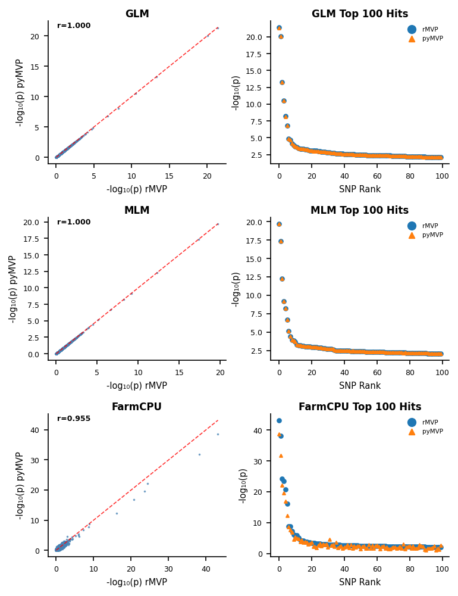

# pyMVP: Python Implementation of rMVP

[](https://www.python.org/downloads/)
[](https://opensource.org/licenses/MIT)

pyMVP implements GLM, MLM, and FarmCPU algorithms for genome wide association study in python. The GLM and MLM implementations in pyMVP should produce identical outputs to those provided by the R/C++ package rMVP. The FarmCPU implementation currently produces similar-but-not-identical outputs to those generated by rMVP. 

**Important disclaimer:** While it project presents an attempted port of the functionality of [rMVP](https://github.com/xiaolei-lab/rMVP) maintained by Lilin Yina, Hao Zhang et al (see [Yin et al 2021](https://doi.org/10.1016/j.gpb.2020.10.007), this independent python reimplementation is entirely my own. 

If this python package works for you, all credit goes to the original authors of the R library. If this package is buggy or fails, the blame is mine alone.  

## Index

- [Installation](#installation)
- [Quickstart (run_GWAS.py)](#quickstart-rungwaspy)
- [Input Formats](#input-formats)
- [CLI Parameters](#cli-parameters)
- [Outputs](#outputs)
- [Performance Benchmarks](#performance-benchmarks)
- [Comparisons](#comparisons)
- [License](#license)
- [Citations](#citations)

## Installation

Requirements: Python 3.7+.

### Installation Steps

**Step 1: Clone the Repository**

```bash
git clone https://github.com/jschnable/pyMVP.git
cd pyMVP
```

**Step 2: Choose Installation Method**

Choose the approach that works for your system:

**Option 1: User-local Installation**

```bash
# Install to user directory (no admin/root required)
pip install -e . --user

# Install optional dependencies supporting additional file formats
pip install -e .[plink] --user
pip install -e .[vcf] --user
pip install -e .[all] --user
```

**Option 2: System-wide Override (Use with caution)**

```bash
# Override system package management restrictions
pip install -e . --break-system-packages

# Install optional dependencies supporting additional file formats
pip install -e .[plink] --break-system-packages
pip install -e .[vcf] --break-system-packages
pip install -e .[all] --break-system-packages
```

**Option 3: Virtual Environment**

```bash
# Create and activate virtual environment
python3 -m venv pymvp-env
source pymvp-env/bin/activate  # On Windows: pymvp-env\Scripts\activate

# Core install
pip install -e .

# Install optional dependencies supporting additional file formats
pip install -e .[plink]  # PLINK .bed support
pip install -e .[vcf]    # Faster VCF parsing and .bcf support
pip install -e .[all]    # All optional loaders
```


## Quickstart (run_GWAS.py)

The `scripts/run_GWAS.py` CLI runs the full pipeline: loading, QC, PCA/kinship, association (GLM/MLM/FarmCPU), saving results, and optional plots.

Minimal example (CSV/TSV numeric genotypes):

```bash
python scripts/run_GWAS.py \
  --phenotype data/phenotype.csv \
  --genotype data/genotype_numeric.csv \
  --output results
```

VCF/BCF (auto-detected):

```bash
python scripts/run_GWAS.py -p data/phe.csv -g data/geno.vcf.gz --methods GLM,MLM --max-missing 0.2 --min-maf 0.01
# For .bcf or faster VCF: pip install .[vcf]
```

PLINK .bed (requires bed-reader):

```bash
python scripts/run_GWAS.py -p data/phe.csv -g data/plink_prefix --format plink --min-maf 0.05
```

HapMap .hmp/.hmp.txt:

```bash
python scripts/run_GWAS.py -p data/phe.csv -g data/test.hmp.txt --format hapmap --snps-only
```

Multi-trait in one run (auto-detects all numeric traits):

```bash
python scripts/run_GWAS.py -p data/phe_multi.csv -g data/geno.vcf.gz --outputs all_results manhattan qq
```

## Input Formats

### Genetic Marker Data

pyMVP supports loading genotype data in:

* .vcf (either uncompressed or gzipped.
* .bcf format 
* plink's .bed format (requires matching .bim and .fam files)
* HapMap format. 
* Simple csv/tsv files with the first column holding sample IDs and the remaining columns showing marker data encoded as ref/het/alt = 0/1/2 and missing = -9

If multiple genotype records are listed with the same sample ID, only genetic marker data the **first occurrence in the file is used**.

### Phenotype Data

pyMVP expects phenotype data to be provided as a csv or tsv with one column giving sample IDs and one or more columns containing numeric phenotypes. 

* pyMVP will first attempt to detect the ID column by looking for the names ID, id, IID, sample, Sample, Taxa, taxa, Genotype, genotype, Accession or accession. 
* * If none of these labels are present it will assume the left-most column represents sample IDs. 
* * If two or more of these labels are present the left-most column with a matching name will be used.
* All other columns are assumed to be phenotypes. Phenotypes are coerced to numeric, and all missing or non-numeric values are treated as NA.

You can customize which phenotypes are analyzed using the `--traits` parameter which allows you to provide a  comma-separated list of trait names. If `--traits` is not used all numeric traits present in the phenotype file are analyzed.

**Duplicate Sample IDs**: If multiple phenotype rows have the same individual ID, they are merged by computing the mean across rows for each trait column (missing values ignored). For example, if a phenotype file for height includes ID "Sample001" for 3 rows [1.2, 1.5, NaN], the final height value used for GWAS will be 1.35.

## CLI Parameters

**Required:**

- `--phenotype, -p`: Phenotype file (CSV/TSV with ID and one or more numeric traits).
- `--genotype, -g`: Genotype file (CSV/TSV numeric; VCF/BCF; PLINK; HapMap).

**Common options:**

- `--output, -o`: Output directory (default: `./GWAS_results`).
- `--methods`: Comma-separated list of methods to run (`GLM,MLM,FarmCPU`).
- `--n-pcs`: Number of principal components (default: 3).
- `--traits`: Comma-separated list of trait names; by default, all numeric traits present in the phenotype file are analyzed.
- `--outputs`: Choose any of `all_marker_pvalues`, `significant_marker_pvalues`, `manhattan`, `qq`.

**Significance control:**

- Default: Bonferroni with `alpha=0.05` and the true number of markers.
- `--alpha`: Override alpha used for Bonferroni.
- `--n-eff`: Use an effective number of markers for Bonferroni denominator.
- `--significance`: Fixed p-value threshold; overrides `--alpha` and `--n-eff` when provided.

**Genotype loader/QC options:**

- `--format, -f`: Force genotype format (`csv`, `tsv`, `numeric`, `vcf`, `plink`, `hapmap`). Autodetects by default.
- VCF/BCF: `--no-split-multiallelic`, `--snps-only`.
- All formats: `--drop-monomorphic`, `--max-missing`, `--min-maf`.

**FarmCPU:**
- `--max-iterations`: Maximum iterations (default: 10).

## Outputs

Per trait (label sanitized and uniquified):

- `GWAS_[TraitLabel]_all_results.csv` (if `all_results` selected):
  - Columns: `SNP`, `CHROM`, `POS`, `MAF`, and for each method: `[Method]_Effect`, `[Method]_SE`, `[Method]_Pvalue`, `[Method]_Pvalue_Bonf`.
- `GWAS_[TraitLabel]_significant_SNPs_p[threshold].csv` (if `significant` selected):
  - Rows passing the chosen significance threshold; includes map columns, per-method stats, and a `Method` column.
- Plots (if selected): `GWAS_[TraitLabel]_[Method]_manhattan.png`, `GWAS_[TraitLabel]_[Method]_qq.png`.

Aggregate:

- `GWAS_summary_by_trait_method.csv`: One row per trait × method with summary stats:
  - `n_significant`, `min_pvalue`, `threshold_used`, `alpha`, `n_tests_used`, `n_bonf_significant`.

Notes:

- Bonferroni-adjusted p-values (`[Method]_Pvalue_Bonf`) are reported using the chosen `n_tests_used` (true marker count or `--n-eff`).
- When `--significance` is provided, it overrides alpha/n_eff for significance calls.

## Performance Benchmarks

Based on average performance across 10 phenotypes for synthetic dataset of 1,000 samples with 100,000 genetic markers run on an Apple Laptop with an M3 Pro CPU and 36 GB of RAM and OpenBLAS installed and configured for both implementations. 

| Method | pyMVP Time | rMVP Time | 
|--------|------------|-----------|
| GLM    | 2.7s       | 0.8s      | 
| MLM    | 5.2s       | 9.2s      | 
| FarmCPU| 5.4s       | 7.7s      | 

## Comparisons 

pyMVP exactly duplicates the p-values assigned to genetic markers by rMVP when using the GLM and MLM implementations. 

**However the pyMVP FarmCPU implementation does not yet precisely match the output of the rMVP FarmCPU implementation.** 



## License

Distributed under the MIT license. See [LICENSE](LICENSE).

## Citations

Please cite the underlying algorithms using [the recommended papers from the rMVP repository](https://github.com/xiaolei-lab/rMVP?tab=readme-ov-file#citation).

