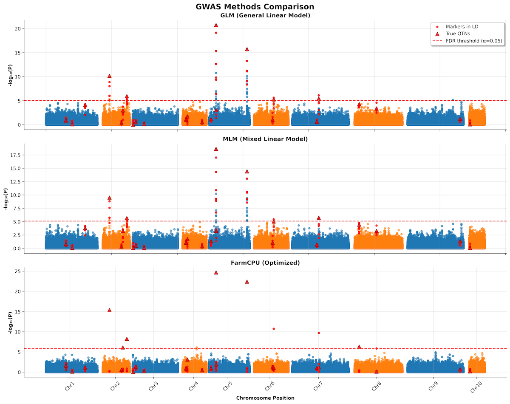

# PANICLE: Python Algorithms for Nucleotide-phenotype Inference and Chromosome-wide Locus Evaluation

[](https://pypi.org/project/panicle/)
[](https://www.python.org/downloads/)
[](https://github.com/jschnable/PANICLE/actions/workflows/ci.yml)
[](https://opensource.org/licenses/MIT)

**PANICLE finds the DNA variants driving traits** — crop yield, disease risk, plant height, anything you can measure — by scanning millions of genetic markers across hundreds or thousands of individuals. It's a fast, modern Python implementation of the four most-used GWAS algorithms (GLM, MLM, FarmCPU, BLINK), built for researchers who want to run GWAS inside their Python pipelines instead of bouncing through R or standalone binaries.



*Manhattan-style multi-method comparison on demo-scale data. The 30-second quick start below writes per-method Manhattan and QQ plots for your trait.*

## Try It in 30 Seconds

The repo ships with a small demo dataset — install, clone for the examples, and run:

```bash
pip install panicle
git clone https://github.com/jschnable/PANICLE.git && cd PANICLE
panicle-gwas \
  --phenotype examples/example_phenotypes.csv \
  --genotype  examples/example_genotypes.vcf.gz \
  --traits PlantHeight \
  --methods GLM \
  --outputdir ./results
```

Equivalent forms: `python -m panicle ...` or `python scripts/run_GWAS.py ...` (compatibility wrapper).

Open `results/` and you'll find a Manhattan plot, a Q-Q plot, and a CSV of significant markers. That's a full GWAS, from raw VCF to publishable figure, with no setup beyond `pip install`.

## Why PANICLE

*   **Fast.** 5.75M markers × 862 samples in ~9 seconds for GLM, ~28s for MLM on a laptop ([benchmarks below](#benchmarks)).
*   **Four algorithms, one interface.** GLM for speed, MLM for population structure, FarmCPU and BLINK for resolving independent loci — pick any combination in one call.
*   **Reads what you have.** VCF/BCF, PLINK, HapMap, or numeric CSV/TSV. First-run parsing is cached to disk so re-analyses load in seconds.
*   **Quality-of-life features other implementations lack.** Effective marker number for less-conservative Bonferroni thresholds, leave-one-chromosome-out MLM by default, FarmCPU resampling with model inclusion probabilities, optional standard errors.
*   **Native Python.** No R bridge, no shelling out to binaries — drop GWAS into pandas/Jupyter/Snakemake pipelines directly.

## Installation

Requires Python 3.9+.

```bash
pip install panicle
```

*With optional dependencies for PLINK format support:*
```bash
pip install panicle[plink]
```

*Or install all optional dependencies:*
```bash
pip install panicle[all]
```

### Development Installation

To install from source for development:
```bash
git clone https://github.com/jschnable/PANICLE.git
cd PANICLE
pip install -e .[all]
```

<details>
<summary><b>Dependencies</b> (click to expand)</summary>

**Core** (installed automatically): `numpy` ≥1.19, `scipy` ≥1.6, `pandas` ≥1.2, `h5py` ≥3.0, `matplotlib` ≥3.3, `numba` ≥0.50, `cyvcf2` ≥0.30.

**Optional**: `bed-reader` ≥1.0 for PLINK `.bed/.bim/.fam` (`pip install panicle[plink]`), `joblib` ≥1.0 for parallel LOCO (`pip install panicle[parallel]`).

</details>

## Python API

The same workflow as the [30-second quick start](#try-it-in-30-seconds), in Python:

```python
from panicle import PANICLE

results = PANICLE(
    phe="examples/example_phenotypes.csv",
    geno="examples/example_genotypes.vcf.gz",
    map_data=None,                # VCF carries its own map; pass a path for numeric CSV/TSV
    n_pcs=3,
    method=["GLM", "MLM", "FarmCPU"],
)
# Results are also saved to CSV files automatically.
```

For finer control (custom alignment, looping over traits, `mlm_mode`), see the [API Reference](docs/api_reference.md) and the [`GWASPipeline`](#pipeline-api) class below.

## What You Get

Each run writes to `--outputdir` (default `./GWAS_results/`):

- **`GWAS_<trait>_all_results.csv`** — every marker, with p-values and effect sizes per method:

  | MARKER | CHROM | POS | REF | ALT | MAF | GLM_P | GLM_Effect |
  |---|---|---|---|---|---|---|---|
  | Chr09_4810793 | Chr09 | 4810793 | G | A | 0.21 | 3.1e-19 | 0.412 |
  | Chr06_2110438 | Chr06 | 2110438 | C | T | 0.14 | 8.4e-08 | -0.047 |
  | … | … | … | … | … | … | … | … |

  (With multiple `--methods`, each adds its own `<METHOD>_P` and `<METHOD>_Effect` columns.)

- **`GWAS_<trait>_significant.csv`** — only markers passing the significance threshold
- **`GWAS_<trait>_<METHOD>_manhattan.png`** — Manhattan plot per method
- **`GWAS_<trait>_<METHOD>_qq.png`** — Q-Q plot for diagnostic checking
- **`GWAS_summary_by_traits_methods.csv`** — one-row-per-(trait, method) summary across the whole run

## CLI Reference

After `pip install panicle`, the primary entry point is **`panicle-gwas`** (also `python -m panicle`). A complete invocation:

```bash
panicle-gwas \
  --phenotype examples/example_phenotypes.csv \
  --genotype  examples/example_genotypes.vcf.gz \
  --traits PlantHeight \
  --methods GLM,MLM,FarmCPU,BLINK \
  --n-pcs 5 \
  --compute-effective-tests \
  --outputs manhattan qq significant_marker_pvalues \
  --outputdir ./results
```

```bash
panicle-gwas --version   # e.g. panicle-gwas 0.5.0
panicle-gwas --help
```

Related tool: **`panicle-cache-genotype`** pre-converts large genotype files for faster reloads.

### Parameters

| Argument | Description | Default |
| :--- | :--- | :--- |
| **`--phenotype`** | Path to phenotype CSV/TSV (must contain ID column). | **Required** |
| **`--phenotype-id-column`** | ID column name in phenotype file. | ID |
| **`--genotype`** | Path to genotype VCF/BCF/CSV. | **Required** |
| **`--map`** | Optional map file (MARKER, CHROM, POS). Legacy `SNP` is also accepted. Recommended for numeric CSV/TSV and LOCO methods. | None |
| **`--format`** | Genotype format override: `vcf`, `plink`, `hapmap`, `csv`, `tsv`, `numeric`. | Auto |
| **`--traits`** | Comma-separated list of columns to analyze. | All numeric |
| **`--methods`** | GWAS methods: `GLM`, `MLM`, `BAYESLOCO`, `FarmCPU`, `BLINK`, `FarmCPUResampling`. | GLM,MLM,FarmCPU |
| **`--n-pcs`** | Number of Principal Components for population structure. | 3 |
| **`--mlm-mode`** | MLM relatedness: `loco` (default, leave-one-chromosome-out when a map is available) or `global` (one VanRaden kinship for all markers, computed internally). | loco |
| **`--min-mac`** | Per-trait minor allele count filter after phenotype missingness (0 disables). | 10 |
| **`--compute-effective-tests`** | Calculate Effective Marker Number (Me) and use it for Bonferroni correction. | False |
| **`--alpha`** | Significance level (e.g., 0.05). Threshold = `alpha / Me` (or `M`). | 0.05 |
| **`--significance`** | Fixed p-value threshold (overrides Bonferroni). | None |
| **`--n-eff`** | Effective number of markers (overrides Me). | None |
| **`--covariates`** | External covariate file. | None |
| **`--covariate-columns`** | Comma-separated covariate column names. | All except ID |
| **`--covariate-id-column`** | ID column name in covariate file. | ID |
| **`--max-iterations`** | Max iterations for FarmCPU/BLINK. | 10 |
| **`--max-genotype-dosage`** | Max dosage (e.g., 2 for diploid). | 2.0 |
| **`--outputdir`** | Output directory. | ./GWAS_results |
| **`--outputs`** | Outputs to generate: `all_marker_pvalues`, `significant_marker_pvalues`, `manhattan`, `qq` (see [docs/output_files.md](docs/output_files.md)). | All |
| **`--include-standard-errors`** | Include `{METHOD}_SE` columns in merged result CSV outputs. | False |
| **`--version`** | Print package version and exit. | — |

Other useful filters:
- `--max-missing` (default 1.0), `--min-maf` (default 0.0)
- `--drop-monomorphic` / `--keep-monomorphic` (drop monomorphic is **on** by default)
- `--snps-only`, `--no-split-multiallelic`

<a id="pipeline-api"></a>
## Pipeline API (step-by-step control)

For multi-step workflows in scripts or notebooks, use the `GWASPipeline` class — it exposes loading, alignment, structure, and analysis as separate steps you can inspect between.

```python
from panicle.pipelines.gwas import GWASPipeline

pipeline = GWASPipeline(output_dir="./results")

pipeline.load_data(
    phenotype_file="examples/example_phenotypes.csv",
    genotype_file="examples/example_genotypes.vcf.gz",
    trait_columns=["PlantHeight"],
    loader_kwargs={"compute_effective_tests": True},
)
pipeline.align_samples()
pipeline.compute_population_structure(n_pcs=5)
pipeline.run_analysis(methods=["GLM", "MLM", "FARMCPU", "BLINK"], alpha=0.05)
```

## Input Formats

### Phenotype & Covariates
CSV or TSV files with an **ID column** and numeric columns for traits/covariates. PANICLE auto-detects ID columns named `ID`, `id`, `IID`, `sample`, `Sample`, `Taxa`, `taxa`, `Genotype`, `genotype`, `Accession`, `accession` (if multiple, it uses the leftmost). If none match, it uses the first column. Use `--phenotype-id-column` (or `--covariate-id-column`) to specify a custom ID column name.

### Genotype
*   **VCF/BCF**: `.vcf`, `.vcf.gz`, `.bcf` (Preferred for performance).
*   **CSV/TSV**: Numeric matrix (rows=samples, cols=markers) + genetic map file with `MARKER`, `CHROM`, and `POS` columns (legacy `SNP` and aliases like `Chr`, `Pos` are accepted).
*   **PLINK**: `.bed` + `.bim` + `.fam`.
*   **HapMap**: `.hmp.txt`.

**Performance notes:** VCF is typically the slowest format on the first run, but PANICLE caches parsed marker data so subsequent loads are competitive with other formats. BCF is roughly ~2x faster than VCF on the first run, and PLINK/bed is roughly ~4x faster than VCF on the first run (exact speedups depend on marker count, sample size, and hardware).

## Tips

1.  **Effective Tests**: Use `--compute-effective-tests` to calculate a less stringent, more accurate Bonferroni threshold based on marker linkage (`Me`).
2.  **Genotype Subsetting**: If you align or filter samples manually, use `GenotypeMatrix.subset_individuals(...)` to preserve pre-imputed fast paths.
3.  **Multiple traits**: Pass traits together to `PANICLE(...)` or the CLI (for example,
    `--traits PlantHeight,DaysToFlower`). GLM automatically shares preparation and
    scans across traits with identical retained samples, including phenotype and
    covariate missingness; MAC filtering still uses each retained sample set.
    The lower-level `PANICLE_GLM_MULTI` accepts an `(individuals, traits)` array
    of values only, without an ID column. Top-level `PANICLE` divides shared GLM
    scan time equally among the grouped traits in its runtime summary.
4.  **GLM prefetch**: With `ncpus`/`--ncpus` greater than 1, sufficiently large GLM
    scans overlap loading the next batch with computation using one worker.
    This does not configure BLAS threads. `PANICLE_GLM_PREFETCH=off` disables it;
    `PANICLE_GLM_PREFETCH=on` enables it for scans exceeding two batches even with
    `ncpus=1`. Benchmark this setting on your data and storage.

## Documentation & Examples

### Documentation

Detailed documentation is available in the [`docs/`](docs/) directory:

- **[Quick Start Guide](docs/quickstart.md)** - Get up and running in 5 minutes
- **[API Reference](docs/api_reference.md)** - Complete API documentation for all functions and classes
- **[Output Files](docs/output_files.md)** - Understanding result file formats and columns

### Interactive Tutorials

- **[GWAS Tutorial notebook](examples/gwas_sorghum_tutorial.ipynb)** — End-to-end `GWASPipeline` on the bundled demo VCF/phenotypes (LOCO MLM, FarmCPU, BLINK).
- **[eQTL Multi-Trait LOCO MLM Acceleration](examples/eqtl_multitrait_acceleration_tutorial.ipynb)** — Synthetic multi-trait LOCO: per-trait vs `PANICLE_MLM_LOCO_MULTI` speedup and hit table.

### Example Scripts

The [`examples/`](examples/) directory contains runnable example scripts with included test data:

| Example | Description |
|---------|-------------|
| [01_basic_gwas.py](examples/01_basic_gwas.py) | Simplest GWAS with GLM |
| [02_mlm_with_structure.py](examples/02_mlm_with_structure.py) | MLM with population structure correction |
| [04_with_covariates.py](examples/04_with_covariates.py) | Including external covariates |
| [05_reading_results.py](examples/05_reading_results.py) | Analyzing and visualizing results |
| [06_farmcpu_resampling.py](examples/06_farmcpu_resampling.py) | FarmCPU resampling with RMIP output |

Run any example:
```bash
cd examples
python 01_basic_gwas.py
```

## Algorithms

### GLM

General Linear Model for fast single-marker association testing. Uses the Frisch-Waugh-Lovell (FWL) theorem combined with QR decomposition for computational efficiency. The algorithm residualizes the phenotype and genotypes against the covariate matrix (PCs + intercept), then computes per-marker regression statistics in vectorized batches. GLM is the fastest GWAS method but may generate overly optimistic significance values.

### MLM

Mixed Linear Model accounting for population structure and cryptic relatedness via a kinship matrix.

**Key design decisions:**
- **LOCO by default**: Leave-One-Chromosome-Out kinship avoids proximal contamination (testing a marker against a kinship matrix that includes that marker), increasing power to detect true associations.
- **Eigenspace transformation**: Data is transformed via eigendecomposition of the kinship matrix, converting the correlated mixed model into an equivalent weighted least squares problem.
- **REML variance components**: Heritability (h²) is estimated using Brent's method optimization of the REML likelihood.

When map data is available, PANICLE's pipeline `MLM` path uses LOCO kinship and applies exact LRT refinement to top hits by default. LRT re-estimates variance components per marker, with a GEMMA-inspired derivative solver available for faster exact refinement versus the legacy bounded-Brent optimizer.

### FarmCPU

Fixed and random model Circulating Probability Unification. FarmCPU iteratively alternates between a fixed-effect model (GLM) and random-effect model to identify associated markers while controlling for polygenic background. FarmCPU can often detect more independent loci linked to variation in the same trait since it controls for the impact of each significant signal when determining the significance of other signals.

This means FarmCPU will NOT give the "towers" most of us expect from classical manhattan plots which are the result of many different markers in LD with the same causal variant. Instead it will identify only one marker since once the effect of this marker is controlled for the significance of any markers in LD with that marker decline to baseline levels. 

FarmCPU Citation: Liu, X., Huang, M., Fan, B., Buckler, E. S., & Zhang, Z. (2016). Iterative usage of fixed and random effect models for powerful and efficient genome-wide association studies. _PLoS genetics_, _12_(2), e1005767.

### BLINK

Bayesian-information and Linkage-disequilibrium Iteratively Nested Keyway. BLINK builds on FarmCPU's iterative framework but uses BIC-based model selection to optimize the pseudo-QTN set. Like FarmCPU, BLINK can often identify larger numbers of independent causal variants from the same phenotype/genotype set than GLM or MLM. Like FarmCPU, it will typically identify only one significant marker per causal variant and lacks the expected "towers" in manhattan plots caused by groups of markers that are all in LD. 

Blink Citation: Huang, M., Liu, X., Zhou, Y., Summers, R. M., & Zhang, Z. (2019). BLINK: a package for the next level of genome-wide association studies with both individuals and markers in the millions. _Gigascience_, _8_(2), giy154.

### Effective Marker Number Estimates

PANICLE includes a python-based based implementation of the effective marker number estimation method implemented in GEC. Accounts for linkage disequilibrium between markers to provide a less conservative multiple testing correction than standard Bonferroni.

GEC citation: Li MX, Yeung JM, Cherny SS, Sham PC. Evaluating the effective numbers of independent tests and significant p-value thresholds in commercial genotyping arrays and public imputation reference datasets. Hum Genet. 2012 May;131(5):747-56.

<a id="benchmarks"></a>
## Benchmarks

Benchmarks based on traits measured from 862 samples, each scored for 5,751,024 markers and run on an Apple M4 CPU (cached VCF).

### Data Loading

| Step                | Time    |
|---------------------|---------|
| Genotype loading    | 1.34s   |
| Phenotype loading   | 0.005s  |
| Sample alignment    | 11.12s  |
| PCA (3 components)  | 2.08s   |
| **Total**           | **14.55s** |

*Note: First run with a given genetic marker file requires substantial time for parsing (≈9 minutes for 5M markers scored for 1000 individuals); subsequent runs use binary cache and load in seconds.*

### Analysis Times (5.75M markers, 862 samples; excludes data loading/result writing)

| Method      | Time    | Notes                                     |
|-------------|---------|-------------------------------------------|
| GLM         | 8.94s   | ~643K markers/second                      |
| MLM         | 28.18s  | LOCO kinship precompute +15.95s = 44.13s total |
| FarmCPU     | 41.90s  | 10 max iterations                         |
| BLINK       | 60.81s  | 10 max iterations                         |

### Scaling by Marker Count (862 samples; includes cached load, alignment, PCA, kinship where relevant)

| Markers    | GLM     | MLM     | FarmCPU  | BLINK   |
|------------|---------|---------|----------|---------|
| 50,000     | 12.09s  | 12.86s  | 12.29s   | 12.42s  |
| 500,000    | 12.78s  | 15.72s  | 14.66s   | 15.74s  |
| 5,000,000  | 19.49s  | 47.12s  | 46.37s   | 58.60s  |

## License

Distributed under the MIT license. See [LICENSE](LICENSE).

---
**Disclaimer:** This is an independent Python implementation of algorithms developed by others. Any errors are mine alone. -James
